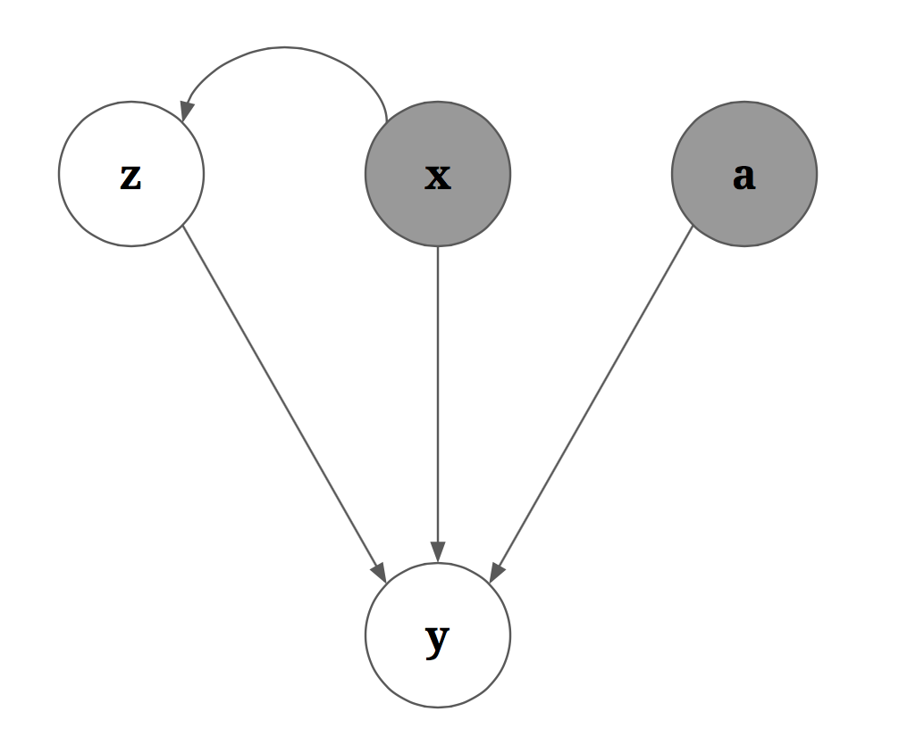

# atari
Here is the code for some of the experiments I did with variational autoencoders on atari video prediction. Note that ths is work-in-progress.

# Motivation
A previous paper on [action-conditional video prediction](http://arxiv.org/abs/1507.08750) demonstrated that neural networks can be used to perform next-frame prediction in an action-conditional manner. As such, they were able to specify the movement of the agent and predict where in the frame the agent will traverse to next.

However, their model [performs poorly](https://www.youtube.com/watch?v=cy96rtUdBuE) when tackling stochastically moving objects in the environment. The ghosts are prone to disappearing in the next-frame prediction. This is because they were using a deterministic network combined with a naive objective function that simply minimizes the mean-squared error between the true frame and the predicted frame.

We can see why this fails in a simple example: consider the case where a stochastic agent is in the center of the frame, and it has equal chance of moving left and moving right. If we train a deterministic network (and MSE loss) to predict what the next frame will look like, the network necessarily cannot decide which of the two next-frames to choose and will ultimately created an average over the two possible future-frames. When doing multi-step prediction, this error is compounded, and the stochastic objects will simply disappear from the predicted frames.

# How Do We Solve This Issue?
The clear solution is to try a deep generative model. There are many choices to play with:
  1. Variational autoencoders
  2. Generative adversarial networks
  3. Real Non-Volume-Preserving Transformation Networks
  4. Spatial Transformer Predictors

Due to certain desirable interpretations of the Variational Autoencoder (VAE), I have chosen to focus on trying a VAE-based architecture for the task of stochastic video prediction.

# Why Would a Variational Autoencoder Help?
The core idea behind VAEs is that we are compressing information into a lower-dimensional latent variable with a much nicer probability density function. For a description of vanilla VAEs, please refer to `modality/README.md`.

To extend the vanilla VAE to an action-conditional video-prediction task, we simply rely on conditioning: 

The above image describes the model that we are going to use for the conditional variational autoencoder. Here, `x` represents the current frame (or history of frames), `a` is the action, `z` is the latent variable, and `y` is the next frame.

This model has an elegant interpretation: the model asserts that the behavior of the stochastic objects can be succinctly described by the latent variable `z` and is conditioned on `x` (thus the arrow from `x` to `z`). Note that similarly, the behavior of the controlled-agent can be succinctly described by the action it takes, `a`.

Because the stochastic objects are stochastic, `z` is still a random variable even after conditioning on `x`. Sampling from `z|x` is equivalent to rolling out a possible trajectory for the stochastic objects. Once we have sampled the trajectory of the stochastic objects, we can use that information (along with the current frame and action information) to construct the new frame `y`.

The training of the conditional variational autoencoder is equally intuitive and easy-to-interpret. During training, we already know what `y` should be, so we focus on asking: "since we already know `y`, `x`, and `a`, what is the value that `z` should have been to properly reconstruct `y` from `x,a,z`?" Recall that the variational autoencoder is really just performing a "nice compression" (i.e. compression into a latent variable with a nice probability density distribution). We can thus think of `z` as being a "nice partial compression" of `y`. The reason why this is a "partial" compression is because `x` and `a` are also used to construct `y`. Therefore, `z` doesn't need to compress all of the information stored in `y` -- `z` only needs to compress the information not accounted for by `x` and `a` (a.k.a. the movement of the stochastic objects). When we train our network, we can think of it as being a restricted information channel of the following form:

By regularizing `z`, we restrict the amount of information that we allow to pass through the `z` channel. The regularization is also what forces `z` to adopt the property of having a nice distribution. This then allows us to sample `z` from the nice distribution during test/prediction-time. Note that `x` and `a` are allowed to bypass the information-restricted channel (this is because we have `x` and `a` at test-time, but not `z`). 

# Does It Actually Work?
*Maybe*. This is the where the "work-in-progress" tag comes in. Training a neural network to perform video prediction has turned out to be a very tedious process (even the original, simpler architecture in the action-conditional paper takes several million iterations to converge to respectable results).

Even when I completely strip away the regularization term for the `z` channel (which should allow for complete information flow, and therefore theoretically near-perfect prediction), I was only able to do ~30% better than the original action-conditional architecture.

I will be playing around with the architecture to see if I can achieve further improvements. But as of the moment, the results are lukewarm at best. 

# Setting up
The dataset for video prediction consists of 500,000 consecutive frames and actions. This data can be downloaded from [here](https://dl.dropboxusercontent.com/u/10792288/action-frames.tar.gz). It's about 750MB.

Once you have downloaded and unzipped the data, the `png` and `action` folders in your desired locations. You will then have to modify code in `DataManager` and `DataLoader` to point to the appropriate filepath. Specifically:
  1. Convert `/local-scratch/rshu15/png/` to `path/to/png/`
  2. Convert `/local-scratch/rshu15/action/` to `path/to/action`

# Running the models
Currently, this repo contains 4 different models that one can run:
  1. `Cnn`: This is a torch implementation of the architecture described in the [action-conditional paper](http://arxiv.org/abs/1507.08750).
  2. `CnnCVae1`: This is a vanilla conditional variational autoencoder version of `Cnn`.
  3. `CnnCVae2`: This is a variant that swaps out the use of the log-likelihood reconstruction term with the mean-squared error reconstruction term.
  4. `CnnCVae3`: This is a sanity-check variaent with zero regularization (designed to overfit)

There is also: `StackedCnn`, but this is a multi-step prediction extension of `Cnn`. More on this later.
      
To models 1-4, simply execute:
```bash
th main.lua --model $MODEL_NAME --gpu $NUMBER_OF_GPUS --learningRate 1e-4
```
This will start the training process, and the trained network will be periodically saved, for example, to:
```bash
save/Cnn_batchNorm=false_preprocess=subMean_learningRate=0.0001_updateRule=adam_maxIter=2000000_iterStep=100000_iterDecay=0.9_ID=1270673724.t7
save/log/Cnn_batchNorm=false_preprocess=subMean_learningRate=0.0001_updateRule=adam_maxIter=2000000_iterStep=100000_iterDecay=0.9_ID=1270673724.log
```
Note that a unique ID is given to the saved network. Once you have trained `Cnn`, you can trained `StackedCnn` by executing:
```bash
th main.lua --model StackedCnn --learningRate 1e-5 --unit $CNN_ID --maxIter 1e6
# for example:
# th main.lua --model StackedCnn --learningRate 1e-5 --unit 1270673724 --maxIter 1e6
```
The `StackedCnn` simply constructs a recursive version of the 1-step prediction `Cnn` network. The same `Cnn` network is unrolled multiple times and trained via BPTT. 

These models can take a really long time to run (several days), so if you ever have to stop and resume training a network, simply do:
```bash
th main.lua --name NETWORK_NAME --gpu $NUMBER_OF_GPUS
# example:
# th main.lua --name Cnn_batchNorm=false_preprocess=subMean_learningRate=0.0001_updateRule=adam_maxIter=2000000_iterStep=100000_iterDecay=0.9_ID=1270673724 --gpu 4
```
Note that because the minibatches are smaller for the `StackedCnn`, it is not worthwhile to run `StackedCnn` in a multi-GPU environment.