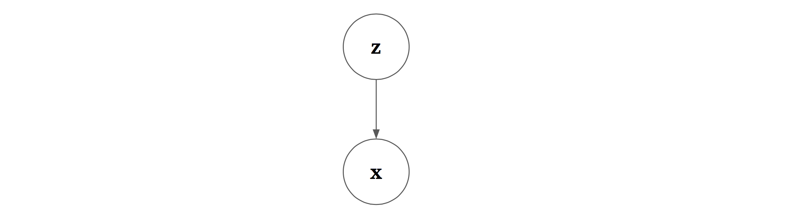
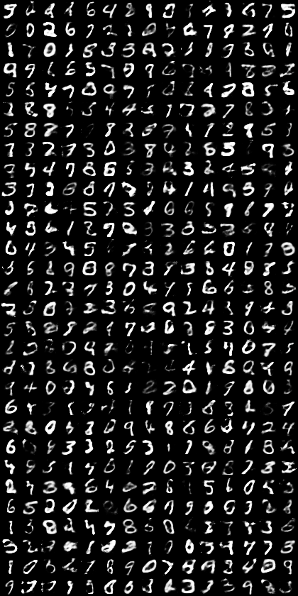
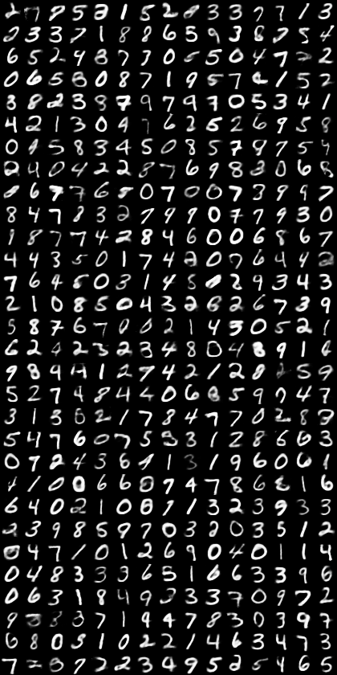
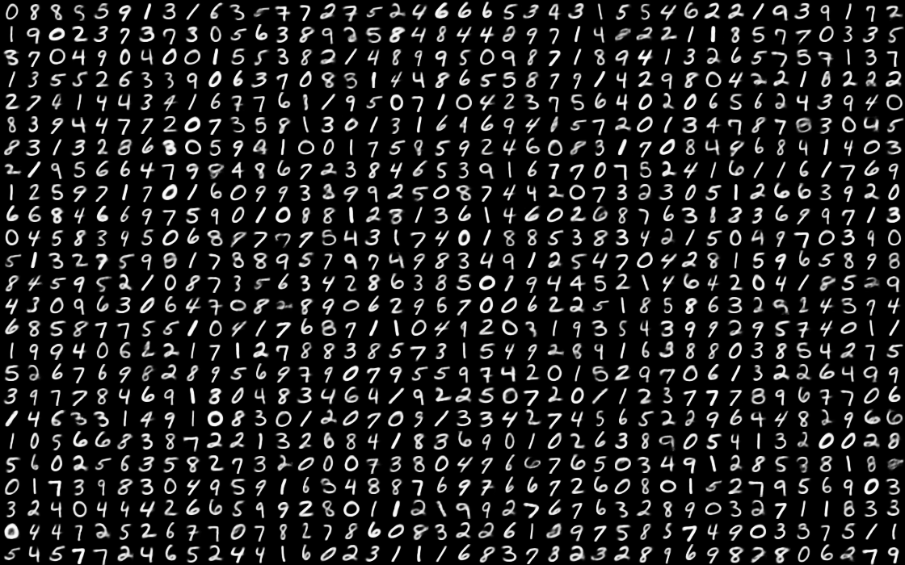

# multi-modality
Here is the code for the MNIST-related experiments I did with variational autoencoders on multi-modality.

# Standard Variational Autoencoder
When the original [Variational Autoencoder](https://arxiv.org/abs/1312.6114) paper first came out, it provided a computationally tractable way of learning complex generative models. The idea behind the VAE is that many complex data distributions can actually be modeled by a smaller set of latent variables whose probability density distribution is simple to model.

The simplest possible set-up assumes the following Bayesian network describes the "true" model of the data distribution:

Under this set-up, the model asserts that the data distribution of `x` can be modeled by first sampling `z` from p(`z`), followed by sampling from p(`x`|`z`). In order to make this work, we must somehow define p(`z`) and p(`x`|`z`). p(`z`) is fairly straight-forward; because it is a prior, we typically choose it to be some "nice" distribution (this imposes the assumption that the distribution of `z` is nice) such as the unit Gaussian distribution.

The slightly trickier part is computing the distribution p(`x`|`z`). If p(`x`|`z`) is very complex, we are not better off than simply trying to approximate p(`x`) from scratch. The authors of the original paper assert that we can assume diagonal covariance for p(`x`|`z`). In other words, p(`x`|`z`) = `\prod_i p(x_i | z)`. As such, we make the strong assumption that `z` severes the interdependence between the component variables of `x`. However, it is arguable that this assumption is viable provided that the mapping from `z` --> p(`x`|`z`) is expressive.

To allow for this level of expressivity, we argue that this mapping from `z` --> p(`x`|`z`) is learned by a neural network (which I will call the `decoder`). Because the output of the `decoder` is a probability density function:
```
p(x|z) := decoder(z)
```
what we're actually going to do is assume p(`x`|`z`) has a parametric model, and instead use `decoder` to map `z` to the parameters of p(`x`|`z`):
```
parameters of p(x|z) := decoder(z; theta)
```
For completely, I have also included `theta`, which describes the parameter weights of the neural network `decoder`. Now that we have described p(`z`) and p(`x`|`z`), we need to somehow learn `theta`. However, the only thing we have is a dataset of samples `x` (`z` remains unobserved). The task therefore becomes one of inference: given `x`, what should `z` have been? We are effectively asking how to figure out p(`z`|`x`).

This inference problem can be considered under the variational Bayesian inference (VBI) framework, which approximates p(`z`|`x`) (very likely an intractable problem) with a simpler distribution q(`z`|`x`). Here, note again that q(`z`|`x`) can be thought of as a mapping from `x` to q(`z`|`x`), we apply the same trick again, and assert the existence of a neural network (called an `encoder`) such that,
```
parameters of q(`z`|`x`) = encoder(x; phi)
```
Ultimately, for a given sample `x`, VBI formulates the problem as one of KL-minimization:
```
\min_\phi KL(q(z|x) || p(z|x)),
```
While the term p(`z`|`x`) may seem intractable at first, proper algebraic manipulation will yield an expression called the "variational lowerbound", which looks like this:
```
L = KL(q(z|x) || p(z)) + \Expectation_{q(z|x)}[p(x|z)]
```
Remarkably, q(`z`|`x`), p(`z`), and p(`x`|`z`) are all well-defined expressions that we have already defined using our neural networks,
```
L = KL(Normal(encoder(x; phi)) || p(z)) + \Expectation_{z ~ Normal(encoder(x;phi))}[Normal(x; decoder(z;theta))]
```
As is the standard practice, we assume that we are only ever dealing with Gaussian distributions with diagonal covariance matrices. We can then maximize the variational lowerbound by adjusting `phi` and `theta` using stochastic gradient descent.

# Limitations of the Standard Variational Autoencoder and the Possible Fix
A key limitations of the standard VAE is when the data distribution cannot cannot be learned (i.e. the learned p(`z`)p(`x`|`z`; `theta`) never equals the true distribution p(`x`)) when operating under the constraint that both the prior p(`z`) *and* the posterior approximation q(`z`|`x`) are Gaussians. For fans of reddit, [here is an excellent discussion](https://www.reddit.com/r/MachineLearning/comments/30isct/consistency_guarantees_for_variational/) on this issue by the original author Diederik Kingma.

There are many ways to think about this limitation. One way to think about this is to consider the case where we are dead-set on setting the prior p(`z`) to be unit Gaussian. The choice of a Gaussian posterior for q(`z`|`x`) will enforce smoothness requirements (i.e. requiring the learned manifold to be strongly continuous). For data distributions that are strongly multi-modal, this assumption necessarily breaks. In order to partition the Gaussian manifold to map to a multi-modal data distribution, the posterior distribution *cannot* be a simple Gaussian. This is in contrast to the Generative Adversarial Network, which does not impose smoothness assumptions.

There are two resolutions to this issue. Either the posterior must not be Gaussian, or the prior must not be Gaussian. To improve the flexibility of the model, we can use either a Mixture of Gaussians as our prior or as our posterior. The choice of which of the two to break (i.e. which to convert from Gaussian to Mixture of Gaussians) is an interesting one (perhaps for maximum flexibility, we break both?).

If we choose to only break one of them, there are interesting considerations for the possible behaviors of the two choices. If the posterior is a Mixture of Gaussians, we run the risk of introducing multi-modality during inference (in contrast, the desired behavior would be for the posterior Mixture of Gaussians to form a unimodal distribution with a non-Gaussian density form). The the prior is a Mixture of Gaussians, we run the risk of creating separate "islands" of discontinuous manifolds that may break the meaningfulness of the representation in the latent space.

# Mixture of Gaussians Prior
In my experiments, I have chosen to go for the prior as being the Mixture of Gaussians, while preserving the posterior as being a nice, unimodal, Gaussian distribution. At the time, I was very concerned about making sure that the posterior was not multi-modal, which is why I chose this formulation. In retrospect, however, I think there is value in considering the alternative formulation (Gaussian prior, Mixture of Gaussians posterior--both Mixture of Gaussians for both!).

I should add, however, that I am not sure if the reparameterization trick still works if we make the posterior a Mixture of Gaussians, since sampling from `z` can no longer be considered as a differentiable function of the input (a set of Gaussian component parameters) and some noise factor. I don't know if it is legal to simply select one of the Gaussian components at random (which reduces it to the standard VAE formulation). If anyone has a good sense of this, please let me know. 

# Some Results
Using the standard Variational Autoencoder, multi-modalities can cause great pain when trying to scale to higher latent-space dimensionality. For 10-dimensional `z`, sampling from a Gaussian prior v. a Mixture of Gaussian prior (1000 components) yields noticably different results,


Using a Mixture of Gaussian priors allows one to overcome multi-modality in the data distribution almost by reserving a separate, discontinuous manifold for each modality of the data distribution. Furthermore, the center of each Gaussian component in the prior can potentially be used as a means of determining the "top-k characteristic" images from the distribution, where `k` is the number of Gaussian components.

The ability to scale to higher dimensional latent variables is important, because if the number of latent variables is too low, the manifold will not be able to capture all of the complex variations present in the data distribution. In the extreme case where the number of latent variables is zero, the model would only ever produce a single sample that is the global average of all the data from the training set.

# Next Steps
One thing of value is to evaluate the perplexity of the learned distribution. I am fairly confident that this will show a difference between the standard VAE v. the Mixture of Gaussians VAE. The one thing stopping me from pursuing this further is that fact that I have not been able to demonstrate the success of Mixture of Gaussians VAE on a more complicated dataset like CIFAR-10.

However, in retrospect, it remains possible that Mixture of Gaussians VAE is the step in the right direction, and that combination of this approach with other orthogonal approaches (Importance-Weighted Autoencoder and GAN-VAE comes to mind) will produce valuable results.

# Technical Footnote
Using use of a Mixture of Gaussians makes the KL divergence term in the variational lowerbound intractable. Therefore, we have to approximate this value instead. A derivation of this approximation is available in `misc/gmm_kld_derivation.pdf`.